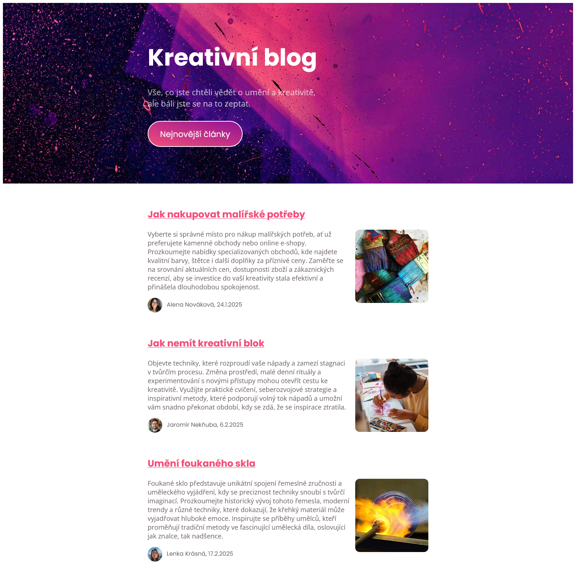

# Projekt: Kreativní blog

*Cvičný projekt pro kurz HTML a CSS (blended)*

## Velikosti

- Všechny **velikosti písma** nastavuj pomocí jednotky `rem`, aby písmo na stránce reagovalo na velikost písma, kterou si uživatel nastavil v prohlížeči. V Google Chrome je to v menu *Nastavení > Vzhled > Velikost písma*. Až budeš mít stránku hotovou, tak si vyzkoušej v prohlížeči změnit písmo na velké a na malé. Změní se ti velikost písma na stránce?
- Šířku kontejneru, který omezuje obsah stránky do sloupce uprostřed nastav také v jednotkách `rem`. Když zvětšíš nebo zmenšíš nastavení velikosti písma v prohlížeči, změní se ti adekvátně i šířka obsahu. To je supr, ne?

## Proměnné pro písma, barvy, rozměry, velikosti

V CSS si vytvoř proměnné a ulož si do nich:

- vybraná písma (fonty)
  - `"Poppins", sans-serif`: pro hlavní titulek, text tlačítka, pro nadpisy článků a meta článků (autor, datum)
  - `"Open Sans", sans-serif`: pro všechno ostatní (běžný text na stránce)
- velikosti písma pro:
  * hlavní nadpis v hlavičce: `4rem`
  * text pod nadpisem v hlavičce: `1.4rem`
  * text tlačítka: `1.4rem`
  * nadpis článku: `1.6rem`
  * meta informace pod článkem (autor, datum vydání) - `1rem`
  * běžného textu na stránce (cokoliv, co není výše jmenované): `1.125rem`
- barvy
  * primární barva: `#f24e7b` - nadpisy článku, začátek barevného přechodu na tlačítku
  * sekundární barva: `#931394` - konec barevného přechodu na tlačítku
  * barva běžného textu na stránce: `#70666c`
- šířku kontejneru (sloupec s obsahem uprostřed široké stránky): `48rem`
- rádius zaoblených rohů u obrázků: `12px`

**Tyto proměnné pak používej na všech místech v CSS, kde je to relevantní.**

**Odhadni** ostatní hodnoty, jako je padding v hlavičce, rozestupy mezi články, apod., aby se tvoje verze visuálně přiblížila obrázkovému zadání (viz níže).

Až budeš mít stránku hotovou, zkus si hodnoty některých proměnných změnit, a podívej se, jestli se ti adekvátně upravil vzhled celé stránky.

## Ukázka výsledku

